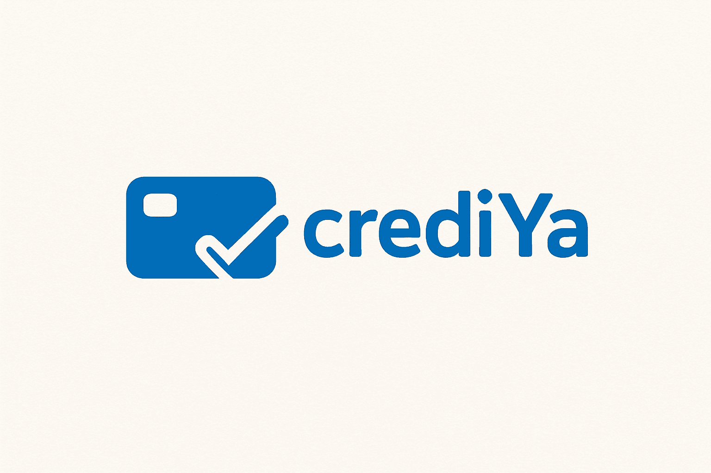
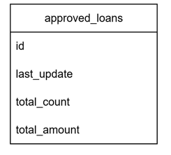
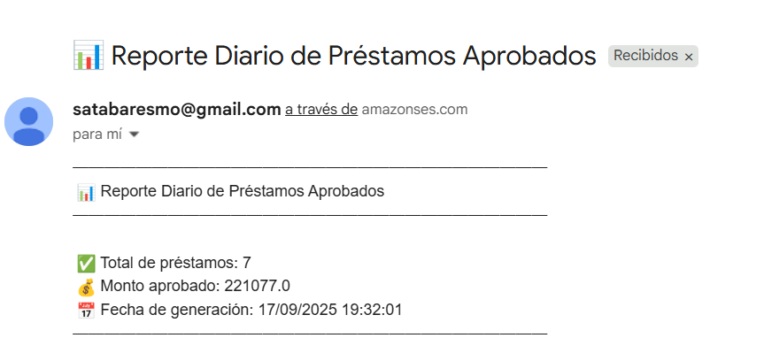

# CrediYa - crediya-report-service

Este microservicio está diseñado para gestionar reportes de préstamos aprobados, almacenando información en DynamoDB y procesando eventos provenientes de la cola SQS. Forma parte del ecosistema CrediYa y sigue los mismos principios de arquitectura hexagonal y desarrollo reactivo.

Cada microservicio en CrediYa se mantiene en un repositorio y base de datos independiente, asegurando modularidad, escalabilidad y mantenibilidad.

# Tecnologías utilizadas

- Java 17 / Spring Boot WebFlux – Desarrollo reactivo y no bloqueante.
- Arquitectura Hexagonal (scaffold) – Separación clara entre dominio, aplicación e infraestructura.
- Gradle – Gestión de dependencias y construcción del proyecto.
- AWS SQS – Recepción de mensajes de solicitudes aprobadas/rechazadas. 
- AWS DynamoDB – Almacenamiento de métricas de préstamos aprobados.
- Swagger / OpenAPI – Documentación de API interactiva.
- SonarLint – Validación de calidad de código en tiempo de desarrollo.
- JUnit + Mockito / Test unitarios – Validación de lógica de negocio.
- Logs de traza y manejo de excepciones – Para monitoreo y control de errores.

# Arquitectura
Para este proyecto se ha utilizado una clean architecture  (utilizando el pluggin de bancolombia scaffold), que se compone de las siguientes capas: .-

- Domain
- Infrastructure
- Application

Este módulo es el más externo de la arquitectura, es el encargado de ensamblar los distintos módulos, resolver las dependencias y crear los beans de los casos de use (UseCases) de forma automática, inyectando en éstos instancias concretas de las dependencias declaradas. Además inicia la aplicación (es el único módulo del proyecto donde encontraremos la función “public static void main(String[] args)”.

# Base de datos
Esta tabla almacena las métricas consolidadas de los préstamos aprobados dentro del ecosistema CrediYa.

id (Partition Key): Identificador único de la fila. En este caso siempre tendrá el valor fijo "APPROVED_LOAN", ya que la tabla funciona como un singleton para centralizar el registro global.

last_update: Fecha y hora de la última actualización de los datos (ISO 8601). Permite llevar trazabilidad de cuándo se procesó el último evento.

total_count: Número total acumulado de préstamos aprobados.

total_amount: Monto total acumulado de los préstamos aprobados.

🔹 Esta tabla se actualiza cada vez que el microservicio crediya-report-service procesa un mensaje desde la SQS de aprobaciones.
🔹 El diseño con un id fijo simplifica el acceso directo a las métricas globales, evitando consultas complejas y priorizando la eficiencia.

# Flujo de funcionamiento

1. Cuando un loan application es aprobado, el microservicio crediya-loan-application-service publica un mensaje en la cola SQS.

2. El microservicio crediya-report-service consume ese mensaje y actualiza en DynamoDB el total de préstamos aprobados y el monto acumulado.

3. La información almacenada puede ser consultada desde la API para generar reportes consolidados.

# Reporte automatizado
El microservicio incluye una funcionalidad para generar y enviar automáticamente un reporte consolidado de préstamos aprobados a una dirección de correo electrónico específica. Este proceso se realiza diariamente a las 8:00 AM y utiliza SES para el envío del correo.

