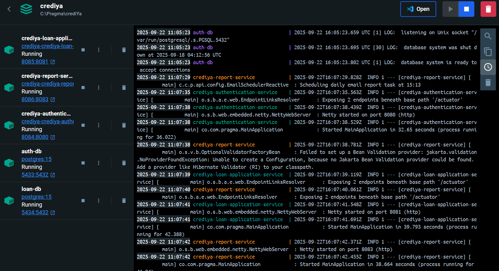
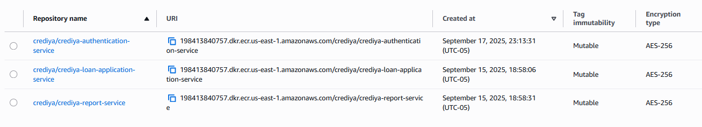

# CrediYa - crediya-report-service

Este microservicio está diseñado para gestionar reportes de préstamos aprobados, almacenando información en DynamoDB y procesando eventos provenientes de la cola SQS. Forma parte del ecosistema CrediYa y sigue los mismos principios de arquitectura hexagonal y desarrollo reactivo.

Cada microservicio en CrediYa se mantiene en un repositorio y base de datos independiente, asegurando modularidad, escalabilidad y mantenibilidad.

# Tecnologías utilizadas

- Java 17 / Spring Boot WebFlux – Desarrollo reactivo y no bloqueante.
- Arquitectura Hexagonal (scaffold) – Separación clara entre dominio, aplicación e infraestructura.
- Gradle – Gestión de dependencias y construcción del proyecto.
- AWS SQS – Recepción de mensajes de solicitudes aprobadas/rechazadas. 
- AWS DynamoDB – Almacenamiento de métricas de préstamos aprobados.
- Swagger / OpenAPI – Documentación de API interactiva.
- SonarLint – Validación de calidad de código en tiempo de desarrollo.
- JUnit + Mockito / Test unitarios – Validación de lógica de negocio.
- Logs de traza y manejo de excepciones – Para monitoreo y control de errores.


# Arquitectura
Para este proyecto se ha utilizado una clean architecture  (utilizando el pluggin de bancolombia scaffold), que se compone de las siguientes capas: .-


- Domain
- Infrastructure
- Application

Este módulo es el más externo de la arquitectura, es el encargado de ensamblar los distintos módulos, resolver las dependencias y crear los beans de los casos de use (UseCases) de forma automática, inyectando en éstos instancias concretas de las dependencias declaradas. Además inicia la aplicación (es el único módulo del proyecto donde encontraremos la función “public static void main(String[] args)”.

# Base de datos
Esta tabla almacena las métricas consolidadas de los préstamos aprobados dentro del ecosistema CrediYa.

id (Partition Key): Identificador único de la fila. En este caso siempre tendrá el valor fijo "APPROVED_LOAN", ya que la tabla funciona como un singleton para centralizar el registro global.

last_update: Fecha y hora de la última actualización de los datos (ISO 8601). Permite llevar trazabilidad de cuándo se procesó el último evento.

total_count: Número total acumulado de préstamos aprobados.

total_amount: Monto total acumulado de los préstamos aprobados.

🔹 Esta tabla se actualiza cada vez que el microservicio crediya-report-service procesa un mensaje desde la SQS de aprobaciones.
🔹 El diseño con un id fijo simplifica el acceso directo a las métricas globales, evitando consultas complejas y priorizando la eficiencia.


# Flujo de funcionamiento

1. Cuando un loan application es aprobado, el microservicio crediya-loan-application-service publica un mensaje en la cola SQS.

2. El microservicio crediya-report-service consume ese mensaje y actualiza en DynamoDB el total de préstamos aprobados y el monto acumulado.

3. La información almacenada puede ser consultada desde la API para generar reportes consolidados.

# Reporte automatizado
El microservicio incluye una funcionalidad para generar y enviar automáticamente un reporte consolidado de préstamos aprobados a una dirección de correo electrónico específica. Este proceso se realiza diariamente a las 8:00 AM y utiliza SES para el envío del correo.


# Despliegue local con Docker

Para desplegar el microservicio localmente utilizando Docker, se proporciona un archivo `docker-compose.yml` que define los servicios necesarios, incluyendo la base de datos PostgreSQL y el propio microservicio. A continuación, se detallan los pasos para ejecutar el despliegue:
1. Asegúrate de tener Docker y Docker Compose instalados en tu máquina.
2. Ya que este repo se despliega junto a otros microservicios se establece el `docker-compose.yml` a un nivel superior, en este caso en la carpeta `crediya-authentication-service`
3. Se crea una carpeta llamada `scripts` y dentro de esta otra llamada `db_auth` donde se coaca el script `init.sql` para inicializar la base de datos con las tablas necesarias .
4. Se debe ejecutar el siguiente comando en la terminal, ubicado en la carpeta donde se encuentra el archivo `docker-compose.yml`:
   ```bash
   docker-compose up --build
   ```
5. Docker Compose se encargará de construir las imágenes necesarias y levantar los contenedores definidos

**Nota:** En la carpeta `deployment` se encuentran los archivos `Dockerfile`, `docker-compose.yml`, el script de inicialización de la BD utilizados para el despliegue.'

**Nota:** Hay un segundo `docker-compose-proxy.yml` en el cual se utiliza gninx como proxy inverso para gestionar las solicitudes a los microservicios. Para ell funcionamiento de este es necesario crear una carpeta llamada `nginx` y dentro de esta colocar el archivo `default.conf` que se encuentra en la carpeta `deployment`.




# Despliegue en AWS

El despliegue en AWS se realiza utilizando servicios como Amazon ECS (Elastic Container Service) para gestionar los contenedores Docker y Amazon RDS (Relational Database Service) para la base de datos PostgreSQL. A continuación, se describen los pasos generales para desplegar el microservicio en AWS:

1. Publicar imagen docker en Amazon ECR (Elastic Container Registry).



2. Crear una instancia de base de datos PostgreSQL en Amazon RDS.


**Nota:** En ambiente local se utiliza una base de datos por cada microservicio, pero en AWS se utiliza una sola base de datos para todos los microservicios, separando la lógica por esquemas.

3. Configurar un clúster de Amazon ECS


4. Definir una tarea que utilice la imagen Docker publicada en ECR.


5. Crear los servicios en el clúster que ejecute la tarea definida.


6. Configurar un Application Load Balancer (ALB) para distribuir el tráfico entre las instancias del servicio.
7. Ejecutar el servicio y verificar que esté funcionando correctamente.


